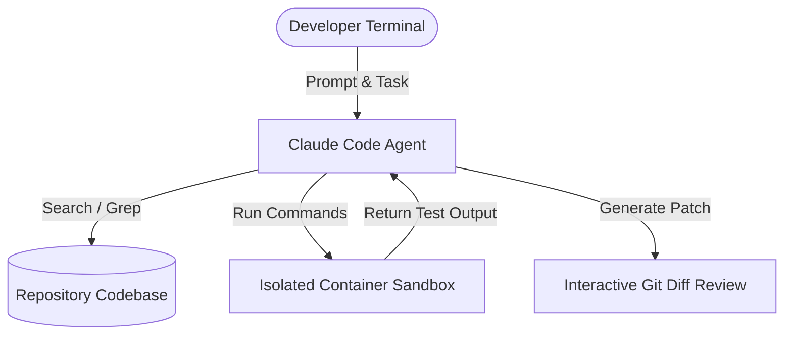

> **Executive summary:** **Claude Code CLI** represents Anthropic's agentic command-line interface, giving Claude direct terminal execution rights to navigate repositories, edit code, run test runners, and draft pull requests. Operating Claude Code safely across complex distributed microservices requires configuring strict **multi-repository context indexing** and **ephemeral sandbox isolation**.

As software engineering shifts from inline snippet generation to autonomous agent pair-programming, developers are adopting terminal-native harnesses like Claude Code. Unlike web-based chatbots, an interactive CLI agent executes shell commands, inspects local git diffs, and iterates on compilation errors in real time.

However, giving an LLM autonomous access to local shell execution introduces serious security, file isolation, and cross-project context challenges. Here is a production guide for configuring Claude Code CLI across multi-repo environments with airtight sandboxing.

## Architecture: How Claude Code Interacts with the Terminal

Claude Code operates as an iterative agent loop:

1. **Context Ingestion:** The CLI scans project roots, parsing `.gitignore`, `package.json`, `Cargo.toml`, or `go.mod` files to construct an internal dependency graph.
2. **Bash Execution Loop:** Instead of merely suggesting code changes, Claude issues structured bash commands to execute test suites, grep directories, and verify syntax.
3. **Diff Verification:** Changes are reviewed via unified diffs before being committed, allowing developers to inspect every modification prior to git commits.



## Multi-Repository Workflows: Bridging Distributed Microservices

Modern enterprise backends are rarely contained in a single repository. A feature often spans a core API service, a frontend web client, and shared protocol definition libraries.

To enable Claude Code to reason across sibling repositories without polluting project context:

### 1. Workspace Configuration via Symbolic Linking
Configure a workspace root with symbolic links to constituent microservices, and define an overarching `.claude-workspace` configuration:

```bash
mkdir enterprise-workspace && cd enterprise-workspace
ln -s ../service-auth ./services/auth
ln -s ../service-billing ./services/billing
ln -s ../web-frontend ./clients/web
```

### 2. Context Boundary Files (`.clauderules`)
Place explicit `.clauderules` files in each repository root to define architectural boundaries and forbidden modifications:

```markdown
# .clauderules in service-billing
- DO NOT alter database schema migrations without explicit confirmation.
- Any change to JWT parsing must preserve backwards compatibility with service-auth v2.4.
- Always run `npm test -- --bail` before marking refactors complete.
```

## Enforcing Ephemeral Sandbox Isolation

Allowing autonomous AI agents to execute arbitrary shell scripts directly on host development machines poses significant security risks. If an agent hallucinates a destructive `rm` command or runs untrusted package dependencies, local environments can be corrupted.

### Docker and Podman Sandbox Wrapper
Deploy Claude Code within an isolated container sandbox that mounts the codebase as a restricted volume while protecting host root credentials:

```bash
docker run -it --rm \
  --name claude-sandbox \
  --network bridge \
  --volume "$(pwd)":/workspace:rw \
  --workdir /workspace \
  --env ANTHROPIC_API_KEY="$ANTHROPIC_API_KEY" \
  anthropic/claude-code:latest \
  claude --sandbox-mode
```

### Security Guardrails in Sandboxed Mode:
- **Network Egress Filtering:** Restrict outgoing HTTP traffic to verified internal staging clusters and authorized package registries (e.g., npm, crates.io, PyPI).
- **Read-Only Root Filesystem:** Container system files remain immutable; only the `/workspace` directory retains write privileges.
- **Process Memory Limits:** Prevent runaway memory consumption during recursive tests by applying strict cgroup limits (`--memory=4g`).

## Automating Git Triage and Pull Request Reviews

One of the highest-leverage applications of Claude Code CLI is automated pull request validation and bug reproduction.

### Example Automated Bug Triage Script:
```bash
# Instruct Claude Code to reproduce an issue from GitHub
claude "Checkout issue #1042, inspect the failed CI test logs in ./test-results, \
reproduce the failure using vitest, apply a minimal fix, and verify tests pass."
```

During this workflow, Claude Code:
1. Identifies the failing test assertion in `./test-results/ci-failure.log`.
2. Runs the isolated test suite: `vitest run tests/auth.spec.ts`.
3. Edits the underlying token decoding logic in `src/auth.ts`.
4. Re-runs the test runner to verify green exit code `0`.
5. Summarizes the root cause and creates a staged git commit with descriptive release notes.

## Frequently Asked Questions

### Can Claude Code CLI run directly in CI/CD pipelines?
Yes. Claude Code can be executed non-interactively in headless mode using the `--batch` flag, allowing GitHub Actions or GitLab CI jobs to invoke automated code linting, documentation updates, and test repairs.

### How does Claude Code handle sensitive environment variables?
By default, Claude Code ignores `.env`, `.env.local`, and common secret files defined in your project's `.gitignore` and security rule sets, preventing credentials from being submitted to model inference streams.

### What is the advantage of Claude Code over web chat interfaces?
Claude Code possesses direct execution feedback: it does not assume code works; it executes the compiler or test runner, inspects stderr output, and autonomously fixes its own bugs until execution succeeds.

## Conclusion

The Claude Code CLI transforms software development by bringing Anthropic's Claude Sonnet and Opus models directly into the terminal. By pairing multi-repository workspace conventions with containerized sandbox isolation, engineering teams can safely accelerate development, automate bug reproduction, and streamline code reviews.
