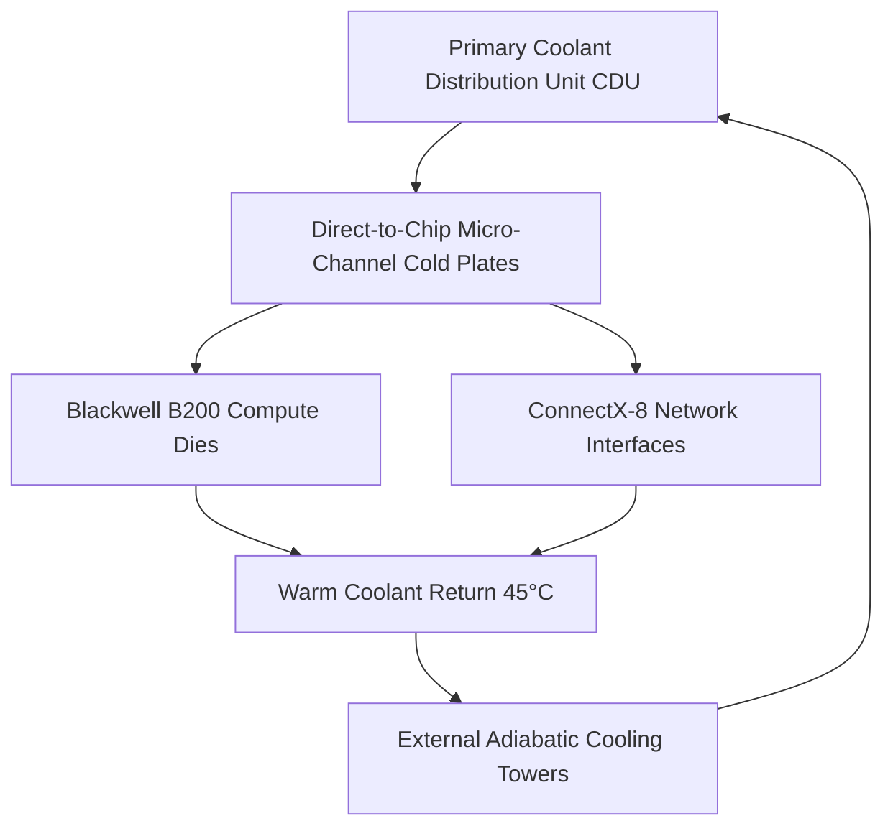

> **Executive summary:** **Colossus 2** is xAI's expanded AI training supercluster located in Memphis, Tennessee. Scaling from the initial 100,000 Nvidia H100 deployment to **over 200,000 GPUs** incorporating next-generation Nvidia Blackwell B200 silicon, Colossus 2 represents one of the largest concentrated compute clusters on Earth, powered by multi-hundred-megawatt utility feeds, direct-to-chip liquid cooling manifolds, and single-hop optical InfiniBand fabrics.

Building frontier artificial intelligence models requires supercomputing infrastructure that challenges the physical limits of municipal power grids, thermal dissipation, and high-frequency network fabrics. When xAI stood up the original Colossus cluster in Memphis in under 122 days, it established a rapid datacenter construction record.

Now, with **Colossus 2**, xAI is expanding the facility to over 200,000 high-performance accelerators dedicated to training **Grok 5**. Below is an engineering teardown of the electrical infrastructure, liquid cooling mechanics, and network topology powering xAI's flagship compute engine.

## Compute Fabric: Blackwell B200 and H100 Heterogeneous Clusters

Training multimodal foundation models requires massive parameter parallelization. Colossus 2 pairs the initial 100k H100 nodes with incoming Nvidia Blackwell B200 NVL72 rack architectures:

| Specification | Colossus 1 Baseline | Colossus 2 Expansion Phase |
|---|---|---|
| **GPU Accelerator Count** | 100,000 Nvidia H100 Tensor Core GPUs | 200,000+ GPUs (H100 + Blackwell B200) |
| **Interconnect Architecture** | 800 Gbps Quantum-2 InfiniBand | 3.2 Tbps Quantum-X800 Optical Fabric |
| **Peak Electrical Draw** | ~150 Megawatts | 300+ Megawatts (Scaling to 1 GW) |
| **Cooling Methodology** | Hybrid Air & Closed-Loop Chilled Water | 100% Direct-to-Chip Liquid Cooling |
| **Primary Mission** | Grok 4.6 & Grok 4.7 Training | Grok 5 Pre-training & Multimodal Video |

## Power Infrastructure: Scaling Beyond the Regional Grid

A datacenter demanding several hundred megawatts cannot plug into standard commercial electrical utility lines without causing municipal grid instability.

### Utility Interconnections and Megawatt Substations
To support Colossus 2, xAI collaborated with local utility providers and the Tennessee Valley Authority (TVA) to construct dedicated high-voltage sub-stations. The facility incorporates:
- **High-Voltage Step-Down Transformers:** Step down 161 kV transmission lines directly to 480V/415V three-phase busbars servicing server rows.
- **Tesla Megapack Grid Buffering:** Industrial-scale battery energy storage systems (BESS) smooth transient power spikes caused by synchronized training checkpoint writes and sudden GPU load shedding.
- **Mobile Turbine Generation:** Temporary natural gas turbine arrays bridge grid interconnection delays, ensuring training runs proceed without waiting for long-lead utility switchgear deployments.

## Thermal Engineering: Direct-to-Chip Closed-Loop Liquid Cooling

Dissipating over 300 megawatts of thermal energy from concentrated server racks is impossible with traditional forced-air HVAC cooling towers alone. The thermal density of an NVL72 rack exceeds 120 kilowatts per cabinet.

### Direct-to-Chip Micro-Channel Mechanics:
1. **Cold Plate Micro-Channels:** Dielectric fluid flows over micro-skived copper channels situated directly atop the GPU and HBM3e memory packages, maintaining die junction temperatures below 75°C under continuous 1,000W thermal design power (TDP).
2. **Coolant Distribution Units (CDUs):** Multi-pump CDUs regulate flow rates, temperature deltas, and pressure curves throughout the server rows.
3. **Leak-Detection and Dry-Break Couplers:** Every rack features automated shutoff valves that isolate individual compute sleds in the event of micro-pressure drops, preventing coolant exposure to live high-voltage components.

## Network Fabric: Non-Blocking Optical InfiniBand

In distributed large-language model training, GPU compute efficiency depends on **all-reduce communication synchronization**. If one accelerator stalls waiting for gradient synchronization, all other 200,000 GPUs sit idle.

To prevent communication bottlenecks:
- **Single-Tier Non-Blocking Optical Fabric:** Incorporating Quantum-X800 optical switches, Colossus 2 eliminates multi-tier network oversubscription.
- **RDMA (Remote Direct Memory Access):** Enables direct memory transfers between GPUs across disparate racks without passing through host CPU operating system kernel stacks.
- **Adaptive Routing:** Hardware-level packet distribution routes around micro-burst network congestion in real time, sustaining over 92% Model Flops Utilization (MFU).

## Frequently Asked Questions

### Where is xAI Colossus located?
Colossus is located in Memphis, Tennessee, occupying a repurposed industrial manufacturing complex re-engineered specifically for high-density compute.

### What model is being trained on Colossus 2?
Colossus 2 is dedicated primarily to pre-training and reinforcement learning fine-tuning for **Grok 5**, xAI's next-generation multimodal foundation model.

### How does Colossus 2 compare to other superclusters?
With over 200,000 interconnected accelerators, Colossus 2 ranks among the top concentrated private AI training facilities globally alongside frontier clusters operated by Meta, Google, and Microsoft.

## Conclusion

Colossus 2 represents a historic milestone in supercomputing infrastructure. By solving the physics hurdles of extreme power delivery, high-density direct-to-chip cooling, and low-latency optical fabrics, xAI has constructed the computational engine necessary to power Grok 5 and push the frontier of artificial intelligence forward.
