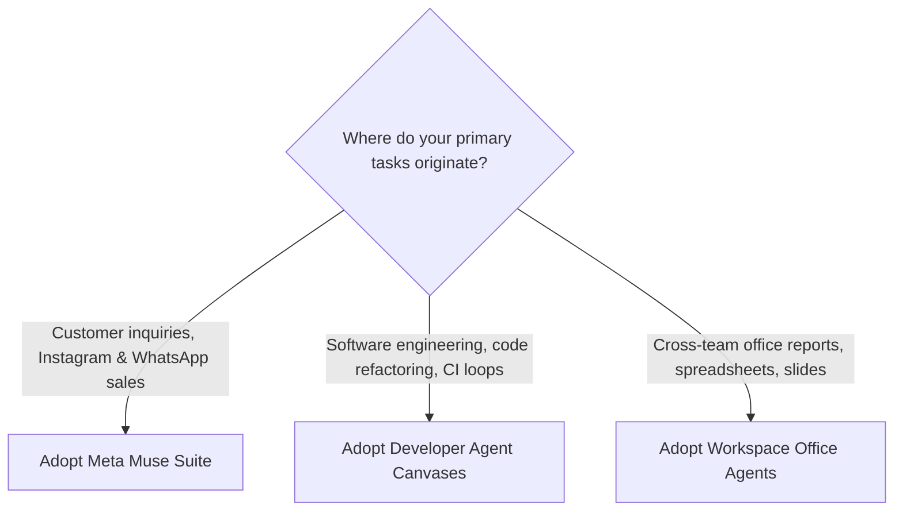

> **Executive summary:** Frontier AI vendors have evolved beyond single-prompt chatbots into interactive agent canvases. **Meta Muse** leads the social commerce and messaging domain across Instagram and WhatsApp; **Dots** targets persistent developer orchestration; and **Spark** integrates directly into office documents. Choosing the right canvas depends on your primary customer channels and operational tech stack.

In 2026, leading AI labs introduced dedicated "canvas" workspaces where models execute multi-step objectives, edit live visual creatives, and maintain stateful project context. 

Below is an engineering and commercial evaluation of these competing platforms, profiling Meta Muse's social messaging architecture against developer graph canvases and office productivity agents.

## Three Divergent Visions for Modern AI Workflows

The term "canvas" represents a persistent digital environment where users define objectives, inspect intermediate steps, and iterate on visual or textual output without starting from scratch.

Each vendor approaches this workspace with distinct commercial advantages:
- **Meta (Muse Ecosystem):** Anchored directly inside existing consumer engagement channels—WhatsApp, Instagram DMs, and Facebook Pages—enabling automated catalog discovery and personalized visual marketing.
- **Developer Orchestration (Dots):** Designed for asynchronous background code generation, cloud browser sandboxing, and autonomous goal fulfillment.
- **Enterprise Office Systems (Spark):** Embedded deeply within shared cloud document suites (spreadsheets, presentations, and team calendars).

| Platform / Metric | Meta Muse Ecosystem | Developer Dots Systems | Workspace Spark |
|---|---|---|---|
| **Primary Deployment** | Instagram DMs, WhatsApp Business | Sandboxed Cloud MicroVMs | Cloud Docs, Sheets, Drive |
| **Core Audience** | SMBs, E-Commerce, Creator Brands | Developers & AI Engineers | Corporate Teams & Enterprise |
| **Primary Media Output** | Ad Creatives, Reels, Catalogs, DMs | Code Patches, JSON Schemas, PRs | Slides, Analytical Sheets, Reports |
| **Setup Friction** | Zero-Code / Native Chat | Intermediate / Configurable Rules | Low / Integrated Suite |

## Meta Muse: Dominating Social Commerce and Visual Messaging

For online retail brands and service businesses operating on social platforms, customer conversations are time-sensitive. If an inquiry arriving via Instagram DM at 11:00 PM goes unanswered until the following morning, prospective buyers frequently bounce.

Meta Muse is designed to resolve this friction directly within messaging threads:

### 1. In-Thread Visual Generation & Markup
Powered by Meta's dedicated image and creative model checkpoints, Muse generates product visuals, seasonal banners, and campaign concepts directly within Meta Business Suite. Business owners can highlight specific elements of a generated graphic to request localized adjustments rather than regenerating the entire image prompt.

### 2. Conversational Catalog Linking
Muse connects to Facebook and Instagram product catalogs, identifying customer intent (e.g., sizing, availability, shipping zones) and serving direct checkout links inside the chat window.

### 3. Human-in-the-Loop Safeguards
Crucially for brand reputation, Muse operates with strict price and stock guardrails. Administrators can configure explicit limits preventing the automated agent from offering unauthorized discounts or promising unconfirmed fulfillment dates.

## Developer Graph Canvases vs. Office Document Workflows

While Meta Muse optimizes for direct consumer interactions and sales conversions, other canvas architectures target internal workflows:

- **Goal-Directed Engineering Pipelines:** When a task requires inspecting GitHub pull requests, linting codebases, and executing continuous integration builds, persistent cloud-sandboxed agents excel by running verification loops in headless environments.
- **Collaborative Enterprise Documentation:** When business teams need to synthesize multi-author meeting transcripts into structured executive slide decks or dynamic spreadsheet models, embedded office canvases eliminate manual copy-pasting across disparate windows.

## Selecting the Optimal Platform for Your Team

### Strategic Recommendations:
1. **Choose Meta Muse if:** Your revenue relies on social commerce, direct-message lead capture, or rapid visual creative production across Meta's app family.
2. **Choose Developer Agent Canvases if:** You require autonomous terminal execution, API integrations, and code synthesis.
3. **Choose Workspace Office Agents if:** Your organization standardizes on centralized cloud spreadsheets and collaborative reporting documents.

## Frequently Asked Questions

### Is Meta Muse suitable for high-volume enterprise e-commerce?
Yes. Meta Muse integrates directly with the WhatsApp Cloud API and Meta Business Suite, enabling enterprise brands to handle tens of thousands of concurrent customer interactions with automated failover to human agents.

### Can Meta Muse generate branded lifestyle photography?
Yes. Muse Image models place clean studio product shots into photorealistic lifestyle scenes, rendering accurate text overlays and typography for promotional banners.

### How does Meta protect customer privacy in messaging chats?
Conversations conducted via business accounts are processed under Meta Enterprise Data Terms, ensuring customer conversation histories are isolated from public model training datasets.

## Conclusion

The rise of dedicated canvas workflows marks the transition of artificial intelligence from conversational novelty to functional operating system. By embedding generative and reasoning models directly into WhatsApp and Instagram, Meta Muse provides retail and digital brands with a decisive tool for automated social commerce.
