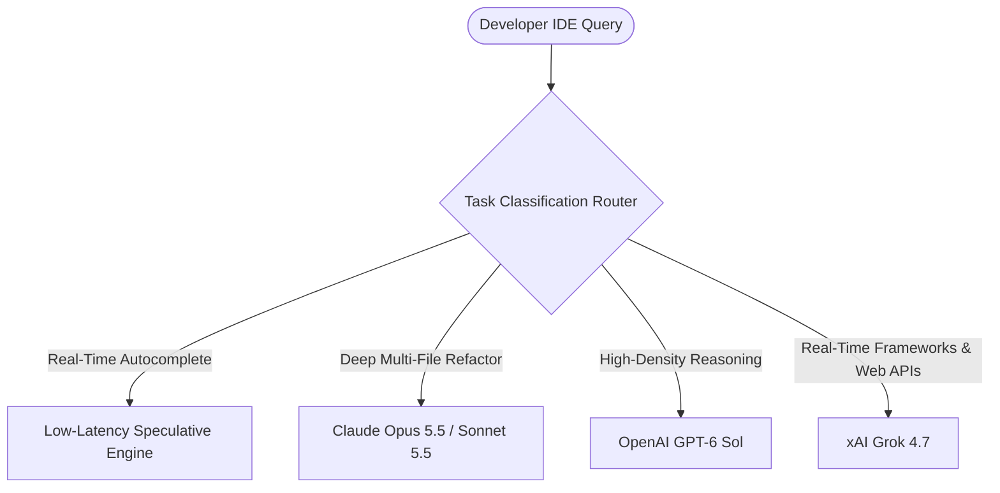

> **Executive summary:** GitHub Copilot has evolved from a single-model autocomplete engine into an intelligent **multi-model developer harness**. Developers can now toggle between or dynamically route prompts across frontier architectures—including **OpenAI GPT-6 Sol**, **Anthropic Claude Opus 5.5**, and **xAI Grok 4.7**—matching specific engineering tasks to optimal latency, context, and reasoning capabilities.

For years, developers interacted with Copilot under the assumption that a single OpenAI model handled all completion and chat requests. As frontier models diverged into specialized domains—some excelling at deep formal verification, others at fast real-time completions—GitHub introduced the **multi-model switcher and dynamic task router**.

Here is an architectural guide to selecting and routing models within GitHub Copilot, analyzing real-world latency trade-offs, token costs, and code generation strengths.

## Why Multi-Model Flexibility Matters in Engineering

No single artificial intelligence model dominates every software engineering dimension:

- **Low-Latency Inline Completions:** Ghost-text autocompletion requires response latencies under 150ms. Heavy reasoning transformers cannot meet this threshold without noticeable editor lag.
- **Deep Refactoring & Architectural Planning:** Refactoring distributed microservices or untangling legacy monolithic dependency graphs requires huge context recall and rigorous chain-of-thought verification.
- **Complex Logic & Concurrency Verification:** Formal mathematical logic, race condition analysis, and cryptographic proofs demand specialized mathematical reasoning.

By allowing developers to switch models within the Copilot chat palette, teams can apply the right intelligence engine to the appropriate stage of the software development lifecycle.

## Model Matrix: Comparative Benchmarks within Copilot

| Model Engine | Primary Strength | Typical TTFT Latency | Best Use Case in Copilot |
|---|---|---|---|
| **OpenAI GPT-6 Sol** | Fast synthetic reasoning, unit tests | 250ms – 400ms | Writing comprehensive test suites, API contracts, JSON schema |
| **Claude Opus 5.5** | Large context recall, architectural refactors | 400ms – 700ms | Migrating legacy codebases, debugging subtle async race conditions |
| **xAI Grok 4.7** | Modern library versions, bleeding-edge syntax | 300ms – 500ms | Developing with freshly released packages, real-time documentation lookup |
| **Copilot Default (Fine-Tuned)** | Sub-second ghost-text prediction | 90ms – 140ms | Single-line autocomplete, inline syntax completion |

## Task Specialization: When to Route to Which Model

### 1. Claude Opus 5.5 for Architectural Refactoring
When restructuring multi-file components or refactoring database queries across repositories, Claude Opus 5.5 consistently demonstrates the lowest hallucination rate on code syntax. Its long-context needle-in-a-haystack retrieval ensures subtle function signature modifications do not break distant callers.

### 2. GPT-6 Sol for Automated Test Generation
When instructing Copilot to generate comprehensive edge-case unit tests (e.g., using pytest, Jest, or Go test), GPT-6 Sol excels at synthesizing boundary-condition test cases, mocking complex external APIs, and covering boundary values.

### 3. Grok 4.7 for Bleeding-Edge SDKs and Frameworks
Because Grok models are fine-tuned on real-time internet data and continuous developer feeds, Grok 4.7 avoids the training cut-off errors common when working with new web frameworks, recent Next.js releases, or rapidly changing cloud SDKs.

## Configuring Model Switching in VS Code and JetBrains

To select specific models within GitHub Copilot Chat:

1. Open Copilot Chat (`Ctrl + Alt + I` or `Cmd + Alt + I`).
2. Click the **Model Picker** dropdown located in the lower-right corner of the chat input box.
3. Select your desired engine: **Auto (Recommended)**, **Claude Opus 5.5**, **GPT-6 Sol**, or **Grok 4.7**.
4. To configure organization-wide defaults, enterprise administrators can enforce approved model whitelists within GitHub Organization Settings.

## Frequently Asked Questions

### Does switching models in GitHub Copilot cost extra?
Access to the multi-model picker is included in GitHub Copilot Business and Enterprise subscriptions. Requests consume standard pooled GitHub AI credits.

### Can Copilot auto-route tasks automatically?
Yes. When set to **Auto**, Copilot analyzes prompt intent, context length, and required tool integrations to route queries to the most efficient model.

### Is code data retained when routed to third-party models?
GitHub maintains zero-data-retention (ZDR) agreements with all underlying model providers (OpenAI, Anthropic, xAI), ensuring private repository code is never used to train foundational models.

## Conclusion

The transition to multi-model routing turns GitHub Copilot into an adaptable engineering workbench. By selecting models based on latency needs, context depth, and task specialization, developers can maximize programming speed and code quality across every phase of software development.
