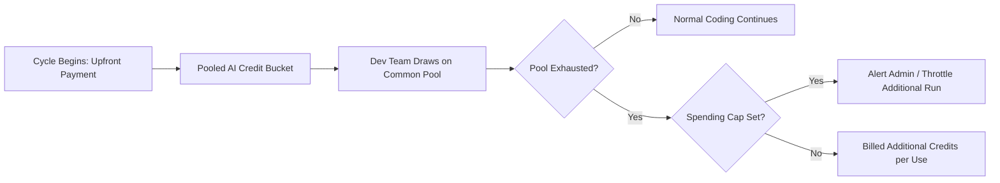

> **Executive summary:** GitHub has updated its billing model for Copilot Business ($19/mo) and Copilot Enterprise ($39/mo) accounts paying via credit card or PayPal to an **upfront prepaid seat model**. Seats are charged at the beginning of each billing cycle with no mid-cycle prorated refunds, and organizations draw from **pooled monthly AI credits**.

For engineering managers and DevOps leads responsible for software tooling budgets, licensing surprises are frustrating. Under GitHub's updated billing terms, removing an inactive developer seat mid-cycle will not generate a prorated refund, while onboarding new engineers requires cleared prepayment before seats become active.

Here is a practical breakdown of how upfront prepaid seats work, how pooled credits are calculated, and how to configure budget guardrails to avoid unexpected invoices.

## What Changed: The Upfront Seat Billing Model

Historically, developer tooling frequently billed in arrears based on peak usage. Under the upfront model:

1. **Prepaid Billing Cycles:** Seats are billed at the start of each billing cycle rather than at the close.
2. **Payment Precedes Provisioning:** When an admin assigns a seat to a new developer, GitHub processes the payment first before granting editor access. If the corporate card hits limits or fails fraud verification, seat activation is paused.
3. **No Prorated Refunds:** If a developer departs mid-cycle and their seat is unassigned, GitHub does not issue a refund for the remaining days. Instead, the user maintains access through the end of the billing period, and the seat is marked not to renew.

## Business vs. Enterprise: Pricing and Pooled AI Credits

| Dimension | Copilot Business | Copilot Enterprise |
|---|---|---|
| **Price per Seat** | $19 / user / month | $39 / user / month |
| **Pooled Credits per Seat** | 1,900 pooled credits / seat / mo | 3,900 pooled credits / seat / mo |
| **Credit Pool Model** | Organization-wide pool | Enterprise-wide pool |
| **Overage Billing** | Billed upon exhaustion | Billed upon exhaustion |
| **Governance Features** | Standard user management | Custom fine-tuning, audit trails, policy enforcement |

### How Organization Credit Pooling Functions
Credits are aggregated into a shared organization pool rather than siloed per user. For example, an engineering group with 20 Copilot Business seats possesses a collective monthly pool of 38,000 credits (20 × 1,900). 

High-frequency developers can utilize more credits than their individual 1,900 allocation without incurring overage fees, provided the team's collective consumption remains within the aggregate total.

## Cost Controls: Preventing Unplanned Credit Spikes

When an organization exhausts its pooled credits, GitHub bills additional credits based on consumption. To prevent budget creep:

- **Configure Spending Limits:** Navigate to Organization Billing -> Spending Limits and establish a strict maximum dollar ceiling for additional Copilot credits.
- **Set Up Real-Time Webhook Alerts:** Configure email and webhook notifications at 75%, 90%, and 100% of credit pool consumption.
- **Implement Department Cost Centers:** If multiple product teams share an enterprise account, assign cost center metadata to group seats by department for transparent internal chargebacks.

## Microsoft Enterprise Agreements (EA) & Azure Billing

Organizations operating under a **Microsoft Enterprise Agreement (EA)** or unified Azure commitment manage Copilot licensing differently. Rather than credit card prepaid billing, EA customers consume seats via Azure commercial volume licensing, consolidating Copilot costs directly against existing cloud drawdown commitments.

## Frequently Asked Questions

### Does GitHub refund unused days if an employee leaves?
No. GitHub does not provide prorated refunds for removed seats. The seat remains usable until the cycle expires and simply does not renew for the following month.

### When should admins conduct license audits?
Engineering admins should establish a recurring calendar reminder 3 to 5 business days prior to cycle renewal to prune inactive or departing users before the next billing invoice executes.

### What happens when pooled AI credits hit zero?
If no spending limit is established, additional credits will be billed at standard rates. If a spending limit is set, supplementary agent features pause while core autocompletion remains active.

## Conclusion

Understanding GitHub Copilot's prepaid upfront seat structure and pooled credit system enables engineering organizations to plan budgets predictably. By instituting pre-renewal seat audits and setting spending limits, teams can scale AI-assisted development across their engineering rosters without unexpected overages.
