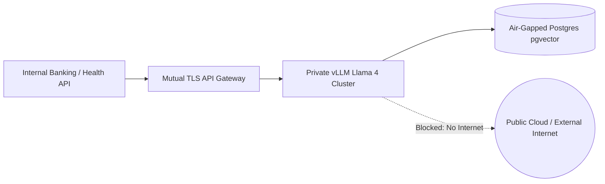

> **Executive summary:** Deploying Meta's open-weights **Llama 4** within private enterprise infrastructure guarantees complete data sovereignty, zero external API egress costs, and microsecond network latencies. By leveraging **QLoRA parameter-efficient fine-tuning**, **FP8 and 4-bit AWQ quantization**, and high-throughput **vLLM inference engines**, organizations can run enterprise-grade models on cost-effective on-premise hardware clusters.

While proprietary cloud models offer simple API access, enterprises operating in healthcare, defense, and fintech face stringent regulatory compliance requirements that forbid transmitting sensitive customer data across third-party networks. Meta's open-weights Llama foundation models provide the ideal foundation for self-hosted enterprise intelligence.

Here is an architectural walkthrough for fine-tuning, quantizing, and deploying Llama 4 on private on-premise infrastructure.

## Hardware Sizing & Memory Requirements

Selecting appropriate hardware depends on precision quantization and inference concurrency:

| Quantization Format | Weight Footprint (Per 70B Params) | Recommended GPU Configuration | Relative Accuracy Retention |
|---|---|---|---|
| **BF16 / FP16 Baseline** | ~140 GB VRAM | 2× H100 80GB (NVLink) or 4× A100 80GB | 100% (Full Precision) |
| **FP8 (Nvidia Ada/Hopper)** | ~70 GB VRAM | 1× H100 80GB or 2× L40S 48GB | 99.4% |
| **4-bit AWQ / GPTQ** | ~38 GB VRAM | 1× A100 40GB or 2× RTX 4090/5090 24GB | 97.8% |
| **2-bit Extreme Quant** | ~22 GB VRAM | Single workstation GPU (Testing only) | ~91.2% (Noticeable degradation) |

*For production workloads, **FP8** delivers the optimum balance of native tensor core acceleration, low latency, and virtually zero perplexity loss on modern GPUs.*

## Parameter-Efficient Fine-Tuning with QLoRA

Fine-tuning all 70B+ model weights simultaneously requires hundreds of gigabytes of distributed optimizer memory. **QLoRA (Quantized Low-Rank Adaptation)** freezes the quantized 4-bit base model while training lightweight low-rank adapter matrices atop attention layers:

```python
from transformers import AutoModelForCausalLM, AutoTokenizer, BitsAndBytesConfig
from peft import LoraConfig, get_peft_model, prepare_model_for_kbit_training
import torch

# 4-bit Quantization Configuration
bnb_config = BitsAndBytesConfig(
    load_in_4bit=True,
    bnb_4bit_quant_type="nf4",
    bnb_4bit_compute_dtype=torch.bfloat16,
    bnb_4bit_use_double_quant=True
)

model = AutoModelForCausalLM.from_pretrained(
    "meta-llama/Llama-4-Enterprise",
    quantization_config=bnb_config,
    device_map="auto"
)

# Configure LoRA Adapters
peft_config = LoraConfig(
    r=32,
    lora_alpha=64,
    target_modules=["q_proj", "k_proj", "v_proj", "o_proj", "gate_proj", "up_proj"],
    lora_dropout=0.05,
    bias="none",
    task_type="CAUSAL_LM"
)

model = prepare_model_for_kbit_training(model)
model = get_peft_model(model, peft_config)
print(f"Trainable parameters: {model.print_trainable_parameters()}")
```

## High-Throughput Serving with vLLM

Once adapters are trained, merge them into the base checkpoint and serve using **vLLM**. By managing memory allocations through **PagedAttention**, vLLM eliminates memory fragmentation and sustains 10x higher request concurrency than naive HuggingFace pipelines.

### Production Docker Deployment Script:
```bash
docker run --gpus all \
  --name llama4-serving \
  -p 8000:8000 \
  -v /data/models/llama-4-quantized:/model:ro \
  vllm/vllm-openai:latest \
  --model /model \
  --tensor-parallel-size 2 \
  --gpu-memory-utilization 0.95 \
  --max-model-len 32768 \
  --kv-cache-dtype fp8 \
  --port 8000
```

### Key Production Flags:
- `--tensor-parallel-size 2`: Shards matrix multiplication across 2 local GPUs via high-bandwidth NVLink.
- `--kv-cache-dtype fp8`: Compresses the KV cache to 8-bit precision, doubling the concurrent context window capacity.
- `--max-model-len 32768`: Enforces a 32k token attention ceiling to guarantee predictable peak memory boundaries.

## Enterprise Security & Zero Egress Architecture



By routing all prompts through an on-premise reverse proxy equipped with strict **Mutual TLS (mTLS)** authentication and firewall egress rules:
1. **Total Data Confinement:** Prompts, clinical records, and proprietary formulas never exit the on-premise perimeter.
2. **Zero Third-Party Model Logging:** Eliminates reliance on vendor data-retention policies.
3. **Deterministic Unit Economics:** Hardware capital costs amortize over three years, delivering predictable fixed-cost operations regardless of token volume.

## Frequently Asked Questions

### Can Llama 4 run on consumer hardware like RTX 4090 or RTX 5090?
Yes. Using 4-bit AWQ or GGUF quantization formats, mid-tier Llama 4 parameter variants run comfortably on dual 24GB consumer GPUs for small team inference workloads.

### How does on-premise inference latency compare to cloud APIs?
On-premise deployments eliminate 70ms to 200ms of public internet transit latency. Local LAN requests to vLLM clusters frequently achieve sub-15ms Time-to-First-Token.

### Does fine-tuning on proprietary data violate Meta's open license?
No. Meta's Llama Community License allows commercial fine-tuning, internal deployment, and application integration for enterprise services complying with standard acceptable use guidelines.

## Conclusion

Deploying Meta's Llama 4 on-premise empowers engineering organizations to break free from proprietary cloud vendor lock-in and unpredictable per-token pricing. By mastering QLoRA adapter training, FP8 quantization, and vLLM serving, modern enterprises can operate high-throughput, secure, and compliant AI clusters entirely within their private infrastructure.
