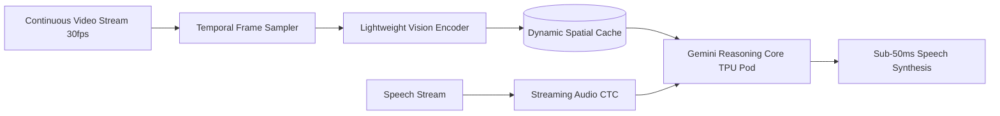

> **Executive summary:** **Project Astra** is Google DeepMind's flagship real-time multimodal AI agent system. By processing continuous high-framerate video and audio streams at **sub-100ms latency**, Project Astra demonstrates real-time spatial memory, object tracking, and immediate conversational feedback across smartphones and smart glasses.

When Google DeepMind demonstrated Project Astra, the demonstration revealed a fundamental evolution in human-AI interaction. Rather than capturing a static snapshot and waiting several seconds for a remote server to reply, Astra ingests a live, unbroken camera feed, answering natural speech questions about physical surroundings instantaneously.

Here is an architectural breakdown of Project Astra’s continuous perception pipeline, spatial memory retention, and low-latency inference mechanics.

## Continuous Video Streaming: The Latency Hurdle

Traditional multimodal vision models operate on discrete image frames: an image is uploaded, encoded into visual tokens via a Vision Transformer (ViT), concatenated with text tokens, and evaluated by an LLM. This process introduces 800ms to 2,000ms of end-to-end latency—unacceptable for conversational dialogue.

Project Astra re-architects this pipeline using continuous temporal streaming:

### Key Latency Optimizations:
1. **Dynamic Frame Sampling:** Astra does not process every 30fps video frame through deep transformer layers. It uses motion-vector heuristics to process keyframes only when physical scene change occurs, drastically reducing token generation overhead.
2. **Streaming Cross-Attention:** Visual representations are continuously streamed into the model's recurrent KV cache, allowing Gemini to recall objects seen seconds or minutes earlier without re-encoding the entire frame history.
3. **Sub-100ms Time-to-First-Token (TTFT):** By pairing speculative decoding with TPU v6 Trillium optical interconnects, Astra delivers conversational spoken responses in well under 100 milliseconds.

## Spatial Memory: Remembering What Leaves the Camera View

A defining capability of Project Astra is **spatial object persistence**. If an Astra user pans their camera past a set of keys on a kitchen counter and later asks "Where did I leave my keys?", Astra answers accurately even though the keys are no longer in frame.

### How Spatial Memory Works:
- **3D Coordinate Reconstruction:** Using monocular depth estimation and device accelerometer/gyroscope telemetry, Astra maps identified visual objects to relative 3D coordinates.
- **Topological Scene Graph:** Objects (e.g., keys, laptops, whiteboard diagrams) are stored as nodes with spatial relationships in an episodic memory store.
- **Query Resolution:** When the user poses a question, the reasoning core queries the local scene graph before resorting to expensive broad-context token searches.

## Edge vs. Cloud: Hardware Deployments

Deploying continuous visual agents poses a severe compute trade-off between local device thermal limits and network transit latency:

| Deployment Vector | Inference Architecture | Latency Budget | Thermal / Power Constraints |
|---|---|---|---|
| **Pixel Smart Glasses** | On-device NPU for audio & frame filtering + 5G Cloud TPU uplink | 60ms – 120ms | Strict 2W thermal limit; battery-sensitive |
| **Pixel Smartphones** | On-device Gemini Nano for initial filter; Cloud Gemini for complex reasoning | 80ms – 140ms | Balanced mobile thermal envelope |
| **Enterprise Cloud Pods** | Distributed TPU v6 Trillium clusters with optical switching | 40ms – 80ms | Unlimited datacenter grid power |

## Project Astra vs. Competing Real-Time Systems

| Capability / Benchmark | Google Project Astra | OpenAI Advanced Voice (GPT-4o) | Meta Aria / Ray-Ban AI |
|---|---|---|---|
| **Primary Input** | Live continuous video + duplex audio | Duplex audio + intermittent snapshots | Single snapshot on voice summon |
| **Spatial Recall** | Persistent 3D scene memory | Session text memory | Minimal spatial persistence |
| **Voice Interruption Latency** | Sub-100ms barge-in | ~250ms barge-in | N/A (single-shot turn) |
| **Target Hardware** | Smart Glasses, Android, WebRTC | Mobile App, macOS, Web | Ray-Ban Smart Glasses |

## Frequently Asked Questions

### Can Project Astra run completely offline?
Initial lightweight scene awareness and voice detection can run locally via on-device NPUs (like Google Tensor), but high-fidelity reasoning and complex scene graphs currently require low-latency cloud TPU connectivity.

### How does Astra respect user privacy with continuous camera feeds?
Google DeepMind implements on-device cryptographic zero-knowledge enclaves: video streams are processed ephemerally in RAM memory and are not stored in permanent server logs unless explicitly requested by the user.

### What is the expected public availability of Project Astra?
Features developed for Project Astra are being integrated progressively into the consumer Gemini mobile app and enterprise Google Cloud Vertex AI multimodal endpoints throughout late 2026.

## Conclusion

Project Astra demonstrates the future of embodied multimodal intelligence. By replacing disconnected photo uploads with continuous, low-latency visual-audio perception and persistent spatial memory, Google DeepMind has laid the foundation for always-on AI assistants across smartphones and smart glasses.
