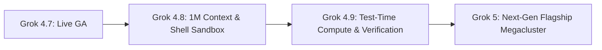

> **Executive summary:** xAI continues its high-cadence development cycle following the release of Grok 4.7. The upcoming **Grok 4.8** and **Grok 4.9** updates serve as critical architectural bridges toward **Grok 5**, bringing **1-million-token context windows**, native **cloud shell execution**, and preview access to **test-time compute verification loops**.

In the frontier artificial intelligence race, xAI has distinguished itself through continuous, rapid-fire releases. Rather than holding model checkpoints for annual keynotes, Elon Musk’s engineering team ships major incremental iterations every 6 to 8 weeks.

Below is an engineering analysis of xAI’s forward-looking model roadmap: the planned capabilities of Grok 4.8, the architectural enhancements of Grok 4.9, and practical steps to prepare production systems.

## xAI's Shipping Cadence: The Path to Grok 5

Over the past four quarters, xAI has maintained one of the fastest deployment tempos in the industry:
- **Grok 4 (July 2025):** Baseline reasoning and real-time X ingestion.
- **Grok 4.3 – 4.5 (Spring/Summer 2026):** Multimodal vision and mathematical synthesis.
- **Grok 4.7 (21 September 2026):** Deep reasoning checkpoints and low-latency API endpoints.

Rather than leaping directly from Grok 4.7 to Grok 5, xAI utilizes point releases (4.8 and 4.9) to validate high-concurrency scaling, massive context expansions, and test-time reasoning algorithms on live developer traffic.

## Grok 4.8: 1 Million Context Tokens and Autonomous Shell Sandboxing

Grok 4.8 targets core developer productivity features:

### 1. Context Window Leap (256k to 1M Tokens)
Expanding the active attention window from 256k tokens to 1 million tokens allows engineering teams to feed entire enterprise repositories, system architectural documentation, or comprehensive legal contracts into a single session without chunking or complex RAG pipeline loss.

### 2. Autonomous Cloud Shell Sandboxing
Grok 4.8 introduces secure cloud terminal sandboxes where the model can execute bash commands, install system dependencies, compile C++/Rust binaries, and run integration test suites in an isolated microVM environment.

### 3. Sub-80ms Audio & Voice Reflex Engine
Targeting conversational latencies under 80ms, the new voice reflex engine enables duplex spoken interaction without the noticeable turn-taking pauses common in first-generation voice models.

## Grok 4.9: Test-Time Compute Preview & Self-Verification

As the direct predecessor to Grok 5, Grok 4.9 introduces advanced reasoning dynamics:

- **Test-Time Compute Scaling:** Instead of generating answers immediately via standard autoregressive passes, Grok 4.9 allocates dynamic compute budgets based on query difficulty, running internal search trees and self-consistency evaluations.
- **Self-Refining Verification Loops:** When generating software code, the model autonomously drafts and runs synthetic unit tests internally, correcting syntax errors and failed assertions before returning final output to the user.
- **Enterprise Zero Data Retention (ZDR):** A dedicated compliance tier ensuring financial and healthcare queries are processed ephemerally in RAM without telemetry storage.

## Roadmap Comparison Matrix

| Release Milestone | Key Architectural Upgrades | Target Developer Focus | Status |
|---|---|---|---|
| **Grok 4.7** | Enhanced CursorBench coding, Fast API tier | Daily software engineering & API apps | **Live / GA** |
| **Grok 4.8** | 1M token context, shell sandbox, 80ms voice | Full-repo refactoring, voice agents | In Development |
| **Grok 4.9** | Test-time compute preview, self-testing code | Complex algorithmic synthesis, ZDR compliance | Planned Bridge |
| **Grok 5** | Megacluster-trained flagship architecture | Frontier autonomous multimodal intelligence | Horizon Roadmap |

## Preparing Production Architectures for Iterative Releases

To benefit from xAI's rapid release cadence without introducing technical debt:
1. **Abstract Model Identifiers:** Never hardcode `grok-4-7` directly into microservice callers; configure dynamic environment variables (`MODEL_GROK_DEFAULT`).
2. **Curate Golden Evaluation Benchmarks:** Maintain a suite of 30 to 50 domain-specific regression tests to validate latency and output parsing before switching production traffic to new releases.
3. **Budget for Test-Time Compute:** Plan token usage budgets according to reasoning effort; extended test-time thinking trades increased inference tokens for mathematical precision.

## Frequently Asked Questions

### What is the primary upgrade expected in Grok 4.8?
The headline features of Grok 4.8 are a 1-million-token context window (up from 256k) and autonomous cloud shell sandboxing for direct command execution.

### Will Grok 4.8 replace Grok 4.7 immediately?
No. xAI maintains backwards compatibility for previous API versions, allowing engineering teams to evaluate new versions in staging before cutting over production workloads.

### How does test-time compute differ from standard generation?
Standard generation generates the next token immediately based on greedy sampling. Test-time compute allows the model to explore multiple reasoning paths and self-correct before outputting the final response.

## Conclusion

The sequential rollout of Grok 4.8 and Grok 4.9 highlights xAI’s commitment to rapid iteration and empirical scaling. By preparing for 1M-token contexts and containerized shell execution, development teams can leverage xAI’s frontier updates effectively as the ecosystem marches toward Grok 5.
